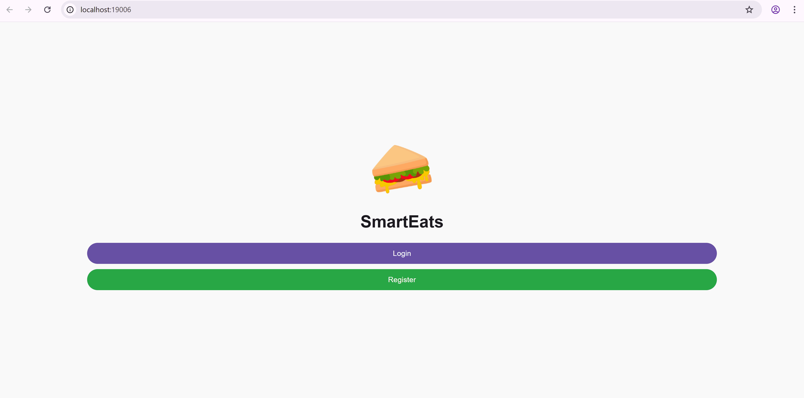

# Food Delivery App - Team 3900-W16A-Banana

Open [LINK](https://expo.dev/accounts/wen123567/projects/SmartEats/builds/36626f96-ccc8-4be9-9f99-1e0b8b5af916) to install the latest build of the app on your **Android** device. Or scan this QR code:


## 1. Project Description

With the growing demand for on-demand food delivery, restaurants are seeking efficient solutions to connect with customers and manage orders seamlessly. Many current food delivery platforms face challenges such as inefficient order management, poor communication between customers, restaurants, and delivery drivers. To address these issues, this project proposes a food delivery mobile application that provides a seamless and user-friendly experience for all participants. We will present our solutions to improve order efficiency, enhance communication, and optimize the delivery process, ensuring a smooth and reliable service for both businesses and customers. In addition, we integrate the ChatGPT API. We encourage restaurant managers to build their own chatbots for automated customer interaction during ordering and menu recommendations. Furthermore, customers can also use the chatbots to get quick responses to common queries, such as order status and payment inquiries.

## 2. Demo Setup (for week 5, week 8, week 10 demo)

1. **Clone the repository**

    ```sh
    git clone git@github.com:unsw-cse-comp99-3900/capstone-project-2025-t1-25t1-3900-w16a-banana.git
    
    cd capstone-project-2025-t1-25t1-3900-w16a-banana
    ```

2. **Ensure Docker Desktop is running**  

    Open **Docker Desktop** on your machine.

3. **Build and start all services**

    Open a terminal and run the `docker-compose` command to build and start the services.

    ```sh
    docker-compose up --force-recreate --build
    ```

    Visit the following urls:

    | Platform | URL |
    |----------|-----|
    | Frontend (**main app**) | [http://localhost:19006](http://localhost:19006) |
    | Backend (API Documentation) | [http://localhost:11000](http://localhost:11000) |

4. We recommend using the Google Chrome browser. In order to use the app screen, press `ctrl + shift + i` to open the developer tools. Then click on the toogle device toolbar icon (or press `ctrl + shift + m`) to switch to mobile view. You can also use the simulator in the Expo DevTools.

    We recommend using the `iphone-12-pro` device in the simulator.

    

5. Default data

    The project has default data for all user types. Please view [demo-materials/README.md](./demo-materials/README.md) for more information. And we have also prepared some images for you to upload during using the app. They are in the [demo-materials folder](./demo-materials/).

6. When you login as a `customer` or `driver`, please turn on the location service in the Chrome browser. Otherwise, the app will not be able to demo the full functionality.

    1. When the location service is off, the app will show a dialog window to ask for opening the location.
    2. Please click on the icon next to the URL and turn on the location service.
    3. Then if you are at the customer account page, the app will show the distance of the customer relative to each restaurant. And the suburb where the customer is currently at is also shown on the top of the page.

    

## 3. Backend Setup (Local Development)

For more details, please refer to the [Backend README.md](./backend/README.md).

The backend is built using the `Flask RestX` framework, with a SQLite database. For local development, you can run the backend server using Python. We recommend using a virtual environment to manage dependencies.

| Step | Mac/Linux | Windows |
|------|-----------|---------|
| Open a terminal at the project root folder | `cd backend` | `cd backend` |
| Create a virtual environment | `python3 -m venv venv` | `python -m venv venv` |
| Activate the virtual environment | `source venv/bin/activate` | `venv\Scripts\activate` |
| Install dependencies | `pip3 install -r requirements.txt` | `pip install -r requirements.txt` |
| Initialize the database | `python3 utils/init_db.py` | `python utils/init_db.py` |
| Run the Flask server | `python3 app.py` | `python app.py` |

Visit [http://localhost:11000](http://localhost:11000) to view the API documentation.

The backend tests are written using the `pytest` framework. You can run the tests using the command,

| Step | Mac/Linux | Windows |
|------|-----------|---------|
| Open a terminal at the project root folder | `cd backend` | `cd backend` |
| Run the tests | `pytest` | `pytest` |

## 4. Frontend Setup (Local Development)

For more details, please refer to the [Frontend README.md](./frontend/README.md).

The frontend includes some mobile apps using React Native and Expo. 

```sh
cd frontend

npm install

npm start
```

The Expo DevTools will show a QR code that you can scan using the Expo Go App on the mobile devices. 

Or enter `w` in the terminal to open the project in the web browser. This will open the app at [http://localhost:8081](http://localhost:8081).

If you have installed Android Studio, you can open any Android Emulator. Then enter `a` in the terminal to run the app on the emulator.

For the project to be running, make sure the backend server is running.

## 5. Team Members

| Name        | ZID       | Email                        | Role                 |
|------------|----------|----------------------------|----------------------|
| Wen Yi     | Z5396337 | Z5396337@student.unsw.edu.au | Scrum Master, Frontend Developer |
| Kwok Yu Siu | Z5458029 | Z5458029@student.unsw.edu.au | Frontend Developer  |
| Tong Ding  | Z5490086 | Z5490086@student.unsw.edu.au | Frontend Developer  |
| Xianyu Cai | Z5454843 | Z5454843@student.unsw.edu.au | Backend Developer   |
| Qiyao Zhou | Z5306160 | Z5306160@student.unsw.edu.au | Backend Developer   |
| Seokho Yang | Z5337452 | Z5337452@student.unsw.edu.au | Project Owner, Backend Developer   |
